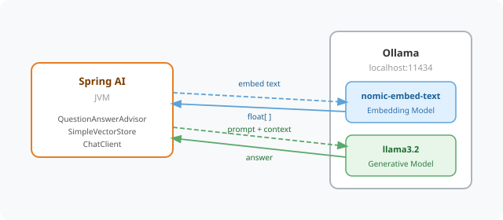

# Chapter 7 — RAG: Answering Questions from Your Own Documents

Give the SmartHR Assistant knowledge of TechCorp's actual HR policies — so employees get answers grounded in real company documents, not generic AI guesses.

---

## Prerequisites

| Tool | Version | Check |
|------|---------|-------|
| Java | 25.0.3 | `java -version` |
| Maven | 3.9.16 | `mvn -version` |
| Ollama | 0.31.1 | `ollama --version` |

> **Versions:** These tutorials should work on the most recent versions of these tools. They were built and tested on **Java 25.0.3**, **Maven 3.9.16**, and **Ollama 0.31.1**.

---

## Setup

### 1. Pull the models

```bash
ollama pull llama3.2
ollama pull nomic-embed-text
```

Two models are needed because they do fundamentally different jobs:



- **`llama3.2`** — the generative model. It reads the retrieved policy chunks and composes a natural language answer.
- **`nomic-embed-text`** — the embedding model. It converts text into a float array (a vector) that captures semantic meaning. This runs in Ollama; Spring AI cannot produce embeddings on its own.

`SimpleVectorStore` only stores the resulting float arrays in the JVM — it never computes them. Every embed call (at ingest time and at query time) goes to Ollama:

```
Text / Question
      │
      ▼
Ollama (nomic-embed-text)   ← neural network runs here, returns float[]
      │
      ▼
SimpleVectorStore (JVM)     ← stores or searches the float[]
```

`nomic-embed-text` is used instead of `llama3.2` for embeddings because embedding models are purpose-built to map text into a semantic vector space — they are smaller, faster, and far better at similarity search. `llama3.2` is a generative model; using it for embeddings would give poor results.

### 2. Start Ollama

```bash
curl -s http://localhost:11434/api/tags
```

If no response, start it:

```bash
ollama serve
```

---

## Run the Application

```bash
cd code/chapter-07-rag
mvn spring-boot:run
```

The app starts on **http://localhost:8080**

At startup it automatically reads `policies/techcorp-hr-policy.txt`, splits it into chunks, embeds each chunk, and loads them into the in-memory vector store — ready to answer questions immediately.

`SimpleVectorStore` is backed by a `ConcurrentHashMap<String, Document>` where each entry holds a policy chunk and its embedding vector. When a question arrives, it embeds the question, iterates over every entry in the map, computes cosine similarity against each stored vector, and returns the top-K closest chunks. It is a brute-force linear scan — no index, no approximate nearest-neighbour — which is fine for a small policy document but will not scale to thousands of chunks. Production systems swap it for a proper vector database such as PgVector or Pinecone.

---

## Endpoints

| Method | URL | Description |
|--------|-----|-------------|
| `POST` | `/hr/policy/ask` | Ask a question grounded in policy documents |
| `POST` | `/hr/policy/ingest` | Add new policy text to the vector store at runtime |

**Ask request shape:**
```json
{
  "question": "How many days of annual leave do I get?"
}
```

**Ask response shape:**
```json
{
  "question": "How many days of annual leave do I get?",
  "answer": "..."
}
```

**Ingest request shape:**
```json
{
  "text": "TechCorp Bonus Policy: All employees are eligible for an annual bonus of up to 15%."
}
```

**Ingest response shape:**
```json
{
  "chunksIngested": 1,
  "message": "Ingested 1 chunk(s) into the policy store."
}
```

---

## Example — Asking About Policy

```bash
curl -s -X POST http://localhost:8080/hr/policy/ask \
  -H "Content-Type: application/json" \
  -d '{"question": "How many days of annual leave do I get?"}'
```

```bash
curl -s -X POST http://localhost:8080/hr/policy/ask \
  -H "Content-Type: application/json" \
  -d '{"question": "What is the remote work policy?"}'
```

```bash
curl -s -X POST http://localhost:8080/hr/policy/ask \
  -H "Content-Type: application/json" \
  -d '{"question": "How many weeks of parental leave does a primary caregiver receive?"}'
```

## Example — Ingesting New Policy

```bash
curl -s -X POST http://localhost:8080/hr/policy/ingest \
  -H "Content-Type: application/json" \
  -d '{"text": "TechCorp Sabbatical Policy: Employees with 5 or more years of service are eligible for a 6-week paid sabbatical."}'
```

After ingesting, the new policy is immediately queryable:

```bash
curl -s -X POST http://localhost:8080/hr/policy/ask \
  -H "Content-Type: application/json" \
  -d '{"question": "Am I eligible for a sabbatical after 5 years?"}'
```

---

## How RAG Works

```
Question: "How many days of annual leave do I get?"

Step 1 — Embed the question:
  question → [0.12, -0.84, 0.33, ...]  (vector)

Step 2 — Retrieve top-K matching chunks from the vector store:
  "All full-time employees are entitled to 20 days of paid annual leave..."

Step 3 — Augment the prompt:
  System:  "You are an HR assistant. Answer based only on the context below."
  Context: "All full-time employees are entitled to 20 days..."
  User:    "How many days of annual leave do I get?"

Step 4 — Generate a grounded answer:
  "Full-time employees at TechCorp are entitled to 20 days of paid annual leave per year."
```

`QuestionAnswerAdvisor` handles Steps 1–3 automatically. It intercepts every `ChatClient` call, embeds the question, retrieves relevant chunks from `SimpleVectorStore`, and injects them into the prompt as context.

---

## Limitations

| Concern | This chapter | Production approach |
|---------|-------------|---------------------|
| Vector store | `SimpleVectorStore` — in-memory, lost on restart | Use PgVector, Redis, or Pinecone |
| Document formats | Plain text via `TikaDocumentReader` | Tika supports PDF, Word, HTML, and more |
| Chunk size | Default `TokenTextSplitter` settings | Tune chunk size and overlap for your docs |

---

## Common Errors

| Error | Cause | Fix |
|-------|-------|-----|
| `Connection refused localhost:11434` | Ollama not running | Run `ollama serve` |
| `model not found` | Model not downloaded | Run `ollama pull llama3.2` and `ollama pull nomic-embed-text` |
| Answers lack policy detail | Embedding model not running | Confirm `nomic-embed-text` is pulled and Ollama is running |
| `Port 8080 already in use` | Another app on 8080 | Set `server.port: 8081` in `application.yml` |

---

## Project Structure

```
chapter-07-rag/
├── pom.xml
├── README.md
└── src/main/
    ├── java/com/techcorp/smarthr/
    │   ├── SmartHrApplication.java
    │   ├── config/
    │   │   └── RagConfig.java              ← SimpleVectorStore + startup ingestion
    │   ├── controller/
    │   │   └── PolicyController.java       ← /hr/policy/ask + /hr/policy/ingest
    │   └── model/
    │       ├── PolicyAskRequest.java
    │       ├── PolicyIngestRequest.java
    │       ├── PolicyResponse.java
    │       └── IngestResponse.java
    └── resources/
        ├── application.yml
        └── policies/
            └── techcorp-hr-policy.txt      ← bundled HR policy document
```

---

*Full chapter write-up: [`content/chapters/chapter-07-rag.md`](../../content/chapters/chapter-07-rag.md)*
