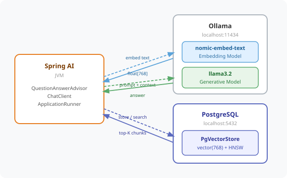

# Chapter 8 — Persistent Vector Store with PgVector

Upgrade the SmartHR policy Q&A from an in-memory vector store to PostgreSQL with pgvector — so policy knowledge survives restarts and scales to thousands of documents.



---

## Prerequisites

| Tool | Version | Check |
|------|---------|-------|
| Java | 25.0.3 | `java -version` |
| Maven | 3.9.16 | `mvn -version` |
| Ollama | 0.31.1 | `ollama --version` |

> **Versions:** These tutorials should work on the most recent versions of these tools. They were built and tested on **Java 25.0.3**, **Maven 3.9.16**, and **Ollama 0.31.1**.
| Docker | latest | `docker --version` |

---

## Setup

### 1. Pull the models

```bash
ollama pull llama3.2
ollama pull nomic-embed-text
```

### 2. Start PostgreSQL with pgvector

```bash
cd code/chapter-08-pgvector
docker-compose up -d
```

Verify it is running:

```bash
docker-compose ps
```

### 3. Start Ollama

```bash
curl -s http://localhost:11434/api/tags
```

If no response, start it:

```bash
ollama serve
```

---

## Run the Application

```bash
cd code/chapter-08-pgvector
mvn spring-boot:run
```

The app starts on **http://localhost:8080**

**First startup:** reads `policies/techcorp-hr-policy.txt`, splits it into chunks, embeds each chunk via `nomic-embed-text`, and stores the vectors in PostgreSQL.

**Subsequent restarts:** detects that the `vector_store` table already has rows and skips ingestion entirely — no duplicate chunks, no re-embedding cost.

---

## What Changed from Chapter 7

The controller, `QuestionAnswerAdvisor`, `TikaDocumentReader`, and `TokenTextSplitter` are **identical to Chapter 7**. Only `RagConfig` changes:

**Chapter 7 — SimpleVectorStore (in-memory):**
```java
@Bean
public SimpleVectorStore vectorStore(EmbeddingModel embeddingModel) {
    SimpleVectorStore store = SimpleVectorStore.builder(embeddingModel).build();
    // ingest called directly — works because SimpleVectorStore needs no afterPropertiesSet()
    ingestPolicy(store);
    return store;
}
```

**Chapter 8 — PgVectorStore (PostgreSQL):**
```java
// import org.springframework.ai.vectorstore.pgvector.PgVectorStore;

@Bean
public VectorStore vectorStore(EmbeddingModel embeddingModel, JdbcTemplate jdbcTemplate) {
    return PgVectorStore.builder(jdbcTemplate, embeddingModel)
            .initializeSchema(true)
            .dimensions(768)
            .distanceType(PgVectorStore.PgDistanceType.COSINE_DISTANCE)
            .indexType(PgVectorStore.PgIndexType.HNSW)
            .build();
}

@Bean
public ApplicationRunner ingestPolicy(VectorStore vectorStore, JdbcTemplate jdbcTemplate) {
    return args -> {
        Integer count = jdbcTemplate.queryForObject(
                "SELECT COUNT(*) FROM vector_store", Integer.class);
        if (Objects.requireNonNullElse(count, 0) > 0) {
            return; // already ingested — skip
        }
        List<Document> chunks = new TokenTextSplitter()
                .apply(new TikaDocumentReader(policyResource).read());
        vectorStore.add(chunks);
    };
}
```

Two important differences from Chapter 7:

1. **`ApplicationRunner` instead of direct call** — `PgVectorStore` implements `InitializingBean`. Spring calls `afterPropertiesSet()` on it after the `@Bean` method returns — that is when it registers the pgvector JDBC type and creates the schema. Calling `store.add()` inside the `@Bean` method would run before that initialisation, causing `PSQLException: Unknown type vector`. `ApplicationRunner` fires after all beans are fully initialised.

2. **Idempotent ingestion** — a `SELECT COUNT(*)` check skips ingestion if rows already exist, so restarting the app never creates duplicate chunks.

Spring AI's `VectorStore` interface abstracts the backend completely — the `PolicyController` and `QuestionAnswerAdvisor` are unchanged.

---

## Endpoints

| Method | URL | Description |
|--------|-----|-------------|
| `POST` | `/hr/policy/ask` | Ask a question grounded in policy documents |
| `POST` | `/hr/policy/ingest` | Add new policy text to the vector store at runtime |

---

## Example Usage

```bash
# Ask a question
curl -s -X POST http://localhost:8080/hr/policy/ask \
  -H "Content-Type: application/json" \
  -d '{"question": "How many days of annual leave do I get?"}'

# Ingest new policy text
curl -s -X POST http://localhost:8080/hr/policy/ingest \
  -H "Content-Type: application/json" \
  -d '{"text": "TechCorp Bonus Policy: All employees are eligible for an annual bonus of up to 15%."}'
```

---

## SimpleVectorStore vs PgVectorStore

| Concern | SimpleVectorStore | PgVectorStore |
|---------|-------------------|---------------|
| Storage | JVM heap | PostgreSQL table |
| Persistence | Lost on restart | Survives restarts |
| Duplicate ingestion | Safe (overwritten) | Prevented by COUNT check |
| Search | O(N) brute-force | O(log N) HNSW index |
| Setup | Zero | Docker |
| Production-ready | No | Yes |

---

## Common Errors

| Error | Cause | Fix |
|-------|-------|-----|
| `Connection refused localhost:5432` | PostgreSQL not running | Run `docker-compose up -d` |
| `Connection refused localhost:11434` | Ollama not running | Run `ollama serve` |
| `model not found` | Model not downloaded | Run `ollama pull llama3.2` and `ollama pull nomic-embed-text` |
| `Unknown type vector` | pgvector type not registered | Ensure ingestion runs via `ApplicationRunner`, not inside `@Bean` |
| `Port 8080 already in use` | Another app on 8080 | Set `server.port: 8081` in `application.yml` |

---

## Project Structure

```
chapter-08-pgvector/
├── docker-compose.yml
├── pom.xml
├── README.md
└── src/main/
    ├── java/com/techcorp/smarthr/
    │   ├── SmartHrApplication.java
    │   ├── config/
    │   │   └── RagConfig.java              ← PgVectorStore bean + idempotent ingestion
    │   ├── controller/
    │   │   └── PolicyController.java       ← /hr/policy/ask + /hr/policy/ingest
    │   └── model/
    │       ├── PolicyAskRequest.java
    │       ├── PolicyIngestRequest.java
    │       ├── PolicyResponse.java
    │       └── IngestResponse.java
    └── resources/
        ├── application.yml
        └── policies/
            └── techcorp-hr-policy.txt
```

---

*Full chapter write-up: [`content/chapters/chapter-08-pgvector.md`](../../content/chapters/chapter-08-pgvector.md)*
