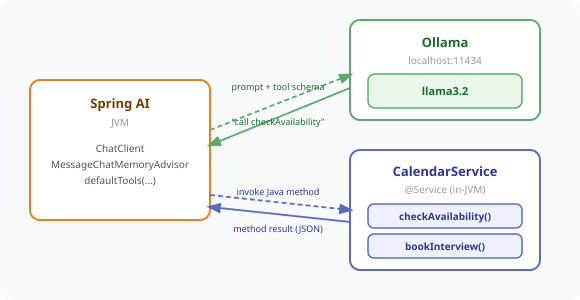

# Chapter 10 — Function Calling: Tool Use and Java Method Binding

Upgrade the SmartHR bot from a Q&A assistant to a doer — the AI calls real Java methods mid-conversation to check calendar availability and book interview slots, instead of just talking about them.



---

## Prerequisites

| Tool | Version | Check |
|------|---------|-------|
| Java | 25.0.3 | `java -version` |
| Maven | 3.9.16 | `mvn -version` |
| Ollama | 0.31.1 | `ollama --version` |

> **Versions:** These tutorials should work on the most recent versions of these tools. They were built and tested on **Java 25.0.3**, **Maven 3.9.16**, and **Ollama 0.31.1**.

---

## Setup

### 1. Pull the model

```bash
ollama pull llama3.2
```

### 2. Start Ollama

```bash
curl -s http://localhost:11434/api/tags
```

If no response, start it:

```bash
ollama serve
```

---

## Run the Application

```bash
cd code/chapter-10-function-calling
mvn spring-boot:run
```

The app starts on **http://localhost:8080**

---

## How It Works

`CalendarService` exposes two Java methods as tools using `@Tool`:

```java
@Tool(description = "Check if a specific date and time slot is available for scheduling an interview")
public CalendarSlot checkAvailability(
        @ToolParam(description = "Date in yyyy-MM-dd format") String date,
        @ToolParam(description = "Time in HH:mm 24-hour format") String time) {
    boolean available = !bookedSlots.contains(key(date, time));
    return new CalendarSlot(date, time, available);
}

@Tool(description = "Book an interview slot in the calendar for a candidate. Only call this after confirming the slot is available.")
public BookingConfirmation bookInterview(
        @ToolParam(description = "Date in yyyy-MM-dd format") String date,
        @ToolParam(description = "Time in HH:mm 24-hour format") String time,
        @ToolParam(description = "Candidate name and role being interviewed for") String candidateInfo) {
    ...
}
```

The `ScheduleController` registers the service as a tool source on the `ChatClient`:

```java
this.chatClient = builder
        .defaultSystem(SYSTEM_PROMPT)
        .defaultTools(calendarService)
        .defaultAdvisors(MessageChatMemoryAdvisor.builder(chatMemory).build())
        .build();
```

Spring AI converts the `@Tool` methods into a JSON schema, sends it to Ollama alongside the prompt, and — when the model decides a tool is needed — invokes the matching Java method and feeds the result back into the conversation, transparently to the caller.

---

## Endpoints

| Method | URL | Description |
|--------|-----|-------------|
| `POST` | `/hr/schedule/chat` | Stateful chat — the LLM may call `CalendarService` tools mid-conversation |
| `DELETE` | `/hr/schedule/chat/{sessionId}` | Clear a session's conversation memory |

---

## Example Usage

```bash
# Turn 1 — check availability
curl -s -X POST http://localhost:8080/hr/schedule/chat \
  -H "Content-Type: application/json" \
  -d '{"sessionId": "lisa-001", "message": "Can you check if Tuesday 2025-06-03 at 2pm is free for a Java developer interview with Priya Sharma?"}'

# Turn 2 — confirm and book
curl -s -X POST http://localhost:8080/hr/schedule/chat \
  -H "Content-Type: application/json" \
  -d '{"sessionId": "lisa-001", "message": "Yes, please book it."}'

# Clear the session
curl -s -X DELETE http://localhost:8080/hr/schedule/chat/lisa-001
```

---

## Why Tool Descriptions Matter

The model has no idea what your Java method actually does — only what the `@Tool` and `@ToolParam` descriptions tell it. Vague descriptions lead to the model guessing wrong, calling the wrong tool, or not calling a tool at all.

| Too vague | Better |
|-----------|--------|
| "Check calendar" | "Check if a specific date and time slot is available for scheduling an interview" |
| "Book meeting" | "Book an interview slot in the calendar for a candidate. Only call this after confirming the slot is available." |

Write descriptions as if explaining the method to a developer who has never seen your codebase.

---

## Common Errors

| Error | Cause | Fix |
|-------|-------|-----|
| `Connection refused localhost:11434` | Ollama not running | Run `ollama serve` |
| `model not found` | Model not downloaded | Run `ollama pull llama3.2` |
| Model never calls the tool | Tool description too vague, or the model doesn't think it needs the tool | Make `@Tool`/`@ToolParam` descriptions more specific |
| `Port 8080 already in use` | Another app on 8080 | Set `server.port: 8081` in `application.yml` |

---

## Project Structure

```
chapter-10-function-calling/
├── pom.xml
├── README.md
└── src/main/
    ├── java/com/techcorp/smarthr/
    │   ├── SmartHrAssistantApplication.java
    │   ├── controller/
    │   │   └── ScheduleController.java     ← /hr/schedule/chat + tool registration
    │   ├── service/
    │   │   └── CalendarService.java        ← @Tool methods: checkAvailability, bookInterview
    │   └── model/
    │       ├── ScheduleRequest.java
    │       ├── HrResponse.java
    │       ├── CalendarSlot.java
    │       └── BookingConfirmation.java
    └── resources/
        └── application.yml
```

---

*Full chapter write-up: [`content/chapters/chapter-10-function-calling.md`](../../content/chapters/chapter-10-function-calling.md)*
