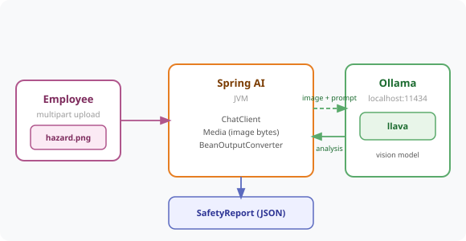

# Chapter 12 — Multimodality: Images and Text Together

Teach the SmartHR bot to see — an employee uploads a photo of a workplace hazard, and a vision model (llava) analyses the image, identifies the risk, and generates a structured safety incident report.



---

## Prerequisites

| Tool | Version | Check |
|------|---------|-------|
| Java | 25.0.3 | `java -version` |
| Maven | 3.9.16 | `mvn -version` |
| Ollama | 0.31.1 | `ollama --version` |

> **Versions:** These tutorials should work on the most recent versions of these tools. They were built and tested on **Java 25.0.3**, **Maven 3.9.16**, and **Ollama 0.31.1**.

---

## Setup

### 1. Pull a vision-capable model

```bash
ollama pull llava
```

> Regular `llama3.2` cannot process images. Vision-capable Ollama models include `llava`, `llava:13b`, `moondream`, and `llama3.2-vision`.

### 2. Start Ollama

```bash
curl -s http://localhost:11434/api/tags
```

If no response, start it:

```bash
ollama serve
```

---

## Run the Application

```bash
cd code/chapter-12-multimodality
mvn spring-boot:run
```

The app starts on **http://localhost:8080**

---

## How It Works

The uploaded photo is wrapped in a Spring AI `Media` object and attached to the user message alongside the text prompt:

```java
Media media = Media.builder()
        .mimeType(MimeType.valueOf(image.getContentType()))
        .data(new ByteArrayResource(image.getBytes()))
        .build();

String analysis = chatClient
        .prompt()
        .user(u -> u
                .text("Analyse this workplace photo for safety hazards. Location: {location} ...")
                .param("location", location)
                .media(media))
        .call()
        .content();
```

The `/hr/safety/report` endpoint goes one step further: it combines the vision analysis with `BeanOutputConverter` (Chapter 5) so the response is a fully typed `SafetyReport` record instead of raw text:

```java
public record SafetyReport(
        String location,
        String hazardDescription,
        String riskLevel,               // LOW / MEDIUM / HIGH
        String recommendedAction,
        boolean requiresIncidentReport
) {}
```

---

## Endpoints

| Method | URL | Description |
|--------|-----|-------------|
| `POST` | `/hr/safety/analyse` | Multipart upload (`image`, `location`) → free-text hazard analysis |
| `POST` | `/hr/safety/report` | Multipart upload (`image`, `location`) → structured `SafetyReport` JSON |

---

## Example Usage

```bash
# Free-text analysis
curl -s -X POST http://localhost:8080/hr/safety/analyse \
  -F "image=@hazard.jpg" \
  -F "location=Floor 3, near the printer"

# Structured incident report
curl -s -X POST http://localhost:8080/hr/safety/report \
  -F "image=@hazard.jpg" \
  -F "location=Floor 3, near the printer"
```

Example structured response:

```json
{
  "location": "Floor 3, near the printer",
  "hazardDescription": "A power cable is trailing across the walkway.",
  "riskLevel": "MEDIUM",
  "recommendedAction": "Tape down or reroute the cable away from the walkway.",
  "requiresIncidentReport": true
}
```

---

## Limitations to Know

| Limitation | Detail |
|-----------|--------|
| Model must be vision-capable | `llava`, `llama3.2-vision` — not all models |
| Image size | Keep under 5MB for reasonable speed (enforced via multipart limits) |
| Accuracy | Vision models are good but not perfect — always have a human review HIGH risk reports |
| Local only | Ollama vision models run locally — image data never leaves your machine |

---

## Common Errors

| Error | Cause | Fix |
|-------|-------|-----|
| `Connection refused localhost:11434` | Ollama not running | Run `ollama serve` |
| `model not found` | llava not downloaded | Run `ollama pull llava` |
| Model ignores the image | Model is not vision-capable | Use `llava` or `llama3.2-vision`, not `llama3.2` |
| `413 Payload Too Large` | Image over 5MB | Resize the image or raise `spring.servlet.multipart.max-file-size` |
| `422 Unprocessable Entity` on `/report` | Model returned non-JSON text | Retry — or lower temperature further |

---

## Project Structure

```
chapter-12-multimodality/
├── pom.xml
├── README.md
└── src/main/
    ├── java/com/techcorp/smarthr/
    │   ├── SmartHrAssistantApplication.java
    │   ├── controller/
    │   │   └── SafetyController.java       ← /hr/safety/analyse + /hr/safety/report
    │   └── model/
    │       ├── SafetyAnalysis.java
    │       └── SafetyReport.java
    └── resources/
        └── application.yml                  ← model: llava, multipart limits
```

---

*Full chapter write-up: [`content/chapters/chapter-12-multimodality.md`](../../content/chapters/chapter-12-multimodality.md)*
