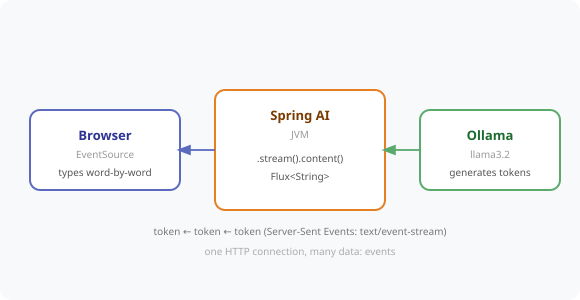

# Chapter 13 — Streaming API: Real-Time Token-by-Token Responses

Stop making users wait for the full answer. Switch `.call()` to `.stream()` and push each token to the browser the instant Llama generates it — the live-typing experience users expect from modern AI chat.



---

## Prerequisites

| Tool | Version | Check |
|------|---------|-------|
| Java | 25.0.3 | `java -version` |
| Maven | 3.9.16 | `mvn -version` |
| Ollama | 0.31.1 | `ollama --version` |

> **Versions:** These tutorials should work on the most recent versions of these tools. They were built and tested on **Java 25.0.3**, **Maven 3.9.16**, and **Ollama 0.31.1**.

---

## Setup

```bash
ollama pull llama3.2
ollama serve   # if not already running
```

---

## Run the Application

```bash
cd code/chapter-13-streaming-api
mvn spring-boot:run
```

The app starts on **http://localhost:8080**. Open it in a browser for the live-streaming chat demo page.

---

## How It Works

The only change from a blocking endpoint is `.call()` → `.stream()`, and returning a `Flux<String>` with the `text/event-stream` content type:

```java
@GetMapping(value = "/ask/stream", produces = MediaType.TEXT_EVENT_STREAM_VALUE)
public Flux<String> streamAnswer(@RequestParam String question) {
    return chatClient
            .prompt()
            .user(question)
            .stream()
            .content()
            .onErrorResume(e -> Flux.just("[stream error: " + e.getMessage() + "]"));
}
```

Spring turns each emitted token into one `data:` Server-Sent Event. Streaming does not speed up generation — it removes the wait before the *first* token appears.

---

## Endpoints

| Method | URL | Description |
|--------|-----|-------------|
| `GET` | `/hr/ask/stream?question=...` | Raw token stream — `Flux<String>` over SSE |
| `GET` | `/hr/ask/stream/tokens?question=...` | Token stream with metadata (`finishReason`) — `Flux<StreamChunk>` over SSE |
| `GET` | `/` | Browser demo page (live-typing chat) |

> Streaming endpoints are `GET` because the browser's `EventSource` API only issues GET requests.

---

## Example Usage

```bash
# -N disables curl's buffering so you see tokens arrive live
curl -N "http://localhost:8080/hr/ask/stream?question=What+is+the+parental+leave+policy%3F"

# With metadata — finishReason is null until the final chunk ("stop")
curl -N "http://localhost:8080/hr/ask/stream/tokens?question=How+many+vacation+days+do+new+employees+get%3F"
```

Raw stream output looks like:

```
data:Tech
data:Corp
data: offers
data: a
data: 401
data:(k
...
```

---

## When to Use Streaming

| Use Streaming | Use Blocking |
|--------------|-------------|
| UI-facing chat interfaces | Backend-to-backend calls |
| Long answers (>3 seconds) | Short answers (<1 second) |
| When UX responsiveness matters | When you need the full text before processing |
| Real-time dashboards | Batch processing, structured-output parsing |

---

## Common Errors

| Error | Cause | Fix |
|-------|-------|-----|
| `Connection refused localhost:11434` | Ollama not running | Run `ollama serve` |
| Browser reconnects in a loop | `EventSource` fires `onerror` on normal completion | Call `source.close()` in `onerror` |
| curl shows nothing until the end | curl is buffering | Add the `-N` flag |
| `Port 8080 already in use` | Another app on 8080 | Set `server.port` or run with `--server.port=8090` |

---

## Project Structure

```
chapter-13-streaming-api/
├── pom.xml
├── README.md
└── src/main/
    ├── java/com/techcorp/smarthr/
    │   ├── SmartHrAssistantApplication.java
    │   ├── controller/
    │   │   └── StreamController.java       ← /hr/ask/stream + /hr/ask/stream/tokens
    │   └── model/
    │       └── StreamChunk.java            ← token + finishReason
    └── resources/
        ├── application.yml
        └── static/
            └── index.html                  ← browser EventSource demo page
```

---

*Full chapter write-up: [`content/chapters/chapter-13-streaming-api.md`](../../content/chapters/chapter-13-streaming-api.md)*
