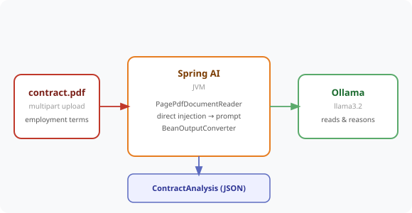

# Chapter 14 — Document Intelligence: PDFs, Word Docs, and Web Pages

Give the SmartHR bot the ability to read. Sarah uploads an employment-contract PDF and gets back a structured first-pass legal review — probation period, notice period, IP ownership, and any non-standard clauses that need a lawyer's eyes.



---

## Prerequisites

| Tool | Version | Check |
|------|---------|-------|
| Java | 25.0.3 | `java -version` |
| Maven | 3.9.16 | `mvn -version` |
| Ollama | 0.31.1 | `ollama --version` |

> **Versions:** These tutorials should work on the most recent versions of these tools. They were built and tested on **Java 25.0.3**, **Maven 3.9.16**, and **Ollama 0.31.1**.

---

## Setup

```bash
ollama pull llama3.2
ollama serve   # if not already running
```

---

## Run the Application

```bash
cd code/chapter-14-document-intelligence
mvn spring-boot:run
```

The app starts on **http://localhost:8080**.

---

## How It Works

Spring AI ships document readers that turn a file into a list of `Document` objects:

```java
// PDF — one Document per page
List<Document> pages = new PagePdfDocumentReader(resource).get();

// Word / HTML / almost anything — via Apache Tika
List<Document> docs = new TikaDocumentReader(resource).get();

// Combine the extracted text
String text = pages.stream().map(Document::getText).collect(Collectors.joining("\n\n"));
```

For a single contract we use **direct injection** — the whole document goes into the prompt — rather than RAG. Combined with `BeanOutputConverter` (Chapter 5), the result is a typed `ContractAnalysis`:

```java
public record ContractAnalysis(
        String summary,
        String probationPeriod,
        String noticePeriod,
        String ipOwnership,
        List<String> nonStandardClauses,
        Boolean requiresLegalReview
) {}
```

> **Carrying Chapter 5's lessons forward:** all fields are boxed/nullable (Spring AI 2.0 uses Jackson 3, which rejects `null` → primitive), the prompt names each field explicitly, and `temperature` is set to `0.0` — so extraction is reliable even on a small local model.

---

## Direct Injection vs RAG

| Approach | When to use |
|----------|-------------|
| **Direct injection** (this chapter) | A single document that fits the context window (~50 pages) |
| **RAG** (Chapter 7) | A large library of documents queried repeatedly |

If a document exceeds the context window, split it first with `TokenTextSplitter.builder()`.

---

## Endpoints

| Method | URL | Description |
|--------|-----|-------------|
| `POST` | `/hr/contract/analyse` | Multipart PDF upload (`file`) → structured `ContractAnalysis` |
| `POST` | `/hr/document/summarise` | Multipart upload (`file`, any Tika format) → `{ filename, summary }` |

---

## Example Usage

```bash
# Structured contract review
curl -s -X POST http://localhost:8080/hr/contract/analyse \
  -F "file=@employment-contract.pdf"

# Plain-text summary of any document (PDF, Word, HTML, ...)
curl -s -X POST http://localhost:8080/hr/document/summarise \
  -F "file=@employment-contract.pdf"
```

Example `ContractAnalysis` response:

```json
{
  "summary": "Employment agreement between TechCorp Ltd and Rahul Menon for a Senior Software Engineer role...",
  "probationPeriod": "six (6) months",
  "noticePeriod": "three (3) months",
  "ipOwnership": "the Company",
  "nonStandardClauses": ["24-month worldwide non-compete", "unpaid on-call"],
  "requiresLegalReview": true
}
```

A sample `employment-contract.pdf` (with deliberate red-flag clauses) ships in this directory.

---

## Common Errors

| Error | Cause | Fix |
|-------|-------|-----|
| `400 Could not read the PDF` | Not a valid PDF | Upload a real, text-based PDF |
| `422 The PDF has no extractable text` | Scanned/image-only PDF | Use a text PDF, or add OCR |
| `422 Could not analyse the contract` | Model returned non-JSON | Retry — temperature is already 0 |
| `413 Payload Too Large` | File over 10MB | Raise `spring.servlet.multipart.max-file-size` |
| `Connection refused localhost:11434` | Ollama not running | Run `ollama serve` |

---

## Project Structure

```
chapter-14-document-intelligence/
├── pom.xml
├── README.md
├── employment-contract.pdf              ← sample fixture with red-flag clauses
└── src/main/
    ├── java/com/techcorp/smarthr/
    │   ├── SmartHrAssistantApplication.java
    │   ├── controller/
    │   │   └── DocumentController.java   ← /hr/contract/analyse + /hr/document/summarise
    │   └── model/
    │       ├── ContractAnalysis.java
    │       └── SummaryResponse.java
    └── resources/
        └── application.yml
```

---

*Full chapter write-up: [`content/chapters/chapter-14-document-intelligence.md`](../../content/chapters/chapter-14-document-intelligence.md)*
