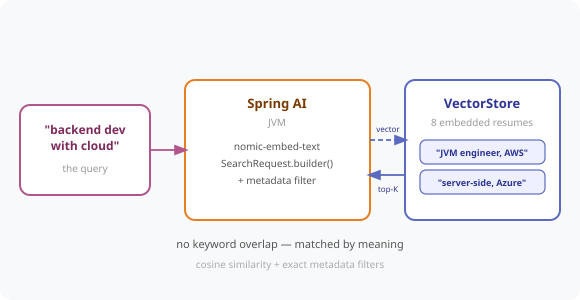

# Chapter 15 — Semantic Search: Finding Meaning, Not Keywords

Search 800 resumes by *meaning*. Lisa types "backend developer with cloud experience" and finds the candidate whose CV says "JVM engineer" and "AWS Lambda" — words her query never used.



---

## Prerequisites

| Tool | Version | Check |
|------|---------|-------|
| Java | 25.0.3 | `java -version` |
| Maven | 3.9.16 | `mvn -version` |
| Ollama | 0.31.1 | `ollama --version` |

> **Versions:** These tutorials should work on the most recent versions of these tools. They were built and tested on **Java 25.0.3**, **Maven 3.9.16**, and **Ollama 0.31.1**.

---

## Setup

```bash
ollama pull nomic-embed-text   # the embedding model — required
ollama serve                   # if not already running
```

> No Docker needed. This chapter uses an in-memory `SimpleVectorStore`, so the 8 sample resumes are re-embedded on each start.

---

## Run the Application

```bash
cd code/chapter-15-semantic-search
mvn spring-boot:run
```

Starts on **http://localhost:8080**. On boot it embeds every resume in `candidates.json`.

---

## How It Works

The resume text is what gets embedded — that's what you search *by meaning*. Everything else (id, name, role, seniority, location) is stored as **metadata**, which is what makes exact filtering possible:

```java
new Document(candidate.resume(), Map.of(
        "candidateId", candidate.candidateId(),
        "name",        candidate.name(),
        "seniority",   candidate.seniority(),
        "location",    candidate.location()
));
```

Search embeds the query and finds the nearest vectors:

```java
SearchRequest.Builder builder = SearchRequest.builder()
        .query(request.query())
        .topK(topK)
        .similarityThreshold(0.0);

builder.filterExpression("seniority == 'SENIOR' && location == 'London'");  // optional

List<Document> matches = vectorStore.similaritySearch(builder.build());
double score = matches.get(0).getScore();   // similarity lives on the Document
```

---

## Endpoints

| Method | URL | Description |
|--------|-----|-------------|
| `GET` | `/hr/candidates` | List all indexed candidates |
| `POST` | `/hr/candidates/search` | Semantic search — `{ query, topK, seniority, location }` → `[CandidateMatch]` |

---

## Example Usage

```bash
# Meaning, not keywords — no CV contains this phrase
curl -s -X POST http://localhost:8080/hr/candidates/search \
  -H "Content-Type: application/json" \
  -d '{"query": "backend developer with cloud experience", "topK": 4}'

# Semantic query + exact filters
curl -s -X POST http://localhost:8080/hr/candidates/search \
  -H "Content-Type: application/json" \
  -d '{"query": "cloud infrastructure", "topK": 10, "seniority": "SENIOR", "location": "London"}'
```

Real output for the first query — note **none** of these resumes contain the words "backend", "developer with cloud", yet all are correct hits:

```
0.6327  C-1005  Elena Rossi     "Java developer ... microservices ... Google Cloud Platform"
0.6270  C-1003  Aisha Khan      "Server-side developer ... Azure Functions"
0.6087  C-1008  Liam O'Brien    "Mobile developer ... Swift"        ← honest noise
0.5924  C-1001  Priya Sharma    "JVM engineer ... AWS Lambda"
```

A keyword search would have returned **zero** of them.

---

## Tuning the Similarity Threshold

| Threshold | Behaviour |
|-----------|-----------|
| `0.9+` | Very strict — near-identical text only |
| `0.75` | Strict — often too strict for short queries |
| `0.6` | Balanced for `nomic-embed-text` |
| `0.0` | Accept all — return everything ranked, let the caller decide |

This chapter uses `0.0` and returns the scores so you can see the real distribution and tune for *your* data. Note the scores above cluster in the **0.59–0.67** band — a `0.75` threshold (as often suggested) would have returned **nothing**. Always measure before you pick a threshold.

---

## Common Errors

| Error | Cause | Fix |
|-------|-------|-----|
| `Connection refused localhost:11434` | Ollama not running | `ollama serve` |
| `model not found` | Embedding model missing | `ollama pull nomic-embed-text` |
| Empty results for every query | Threshold too high for your model | Lower `similarityThreshold` — see the table above |
| Filter returns nothing | Metadata key/value mismatch (case-sensitive) | `seniority == 'SENIOR'`, not `'senior'` |
| `400 query must not be blank` | Empty query | Send a real query string |

---

## Project Structure

```
chapter-15-semantic-search/
├── pom.xml
├── README.md
└── src/main/
    ├── java/com/techcorp/smarthr/
    │   ├── SmartHrAssistantApplication.java
    │   ├── config/
    │   │   └── CandidateIndexConfig.java    ← embeds resumes + metadata at startup
    │   ├── controller/
    │   │   └── CandidateSearchController.java
    │   └── model/
    │       ├── Candidate.java
    │       ├── CandidateSearchRequest.java
    │       └── CandidateMatch.java
    └── resources/
        ├── application.yml
        └── candidates/candidates.json       ← 8 candidates with deliberately varied vocabulary
```

---

*Full chapter write-up: [`content/chapters/chapter-15-semantic-search.md`](../../content/chapters/chapter-15-semantic-search.md)*
