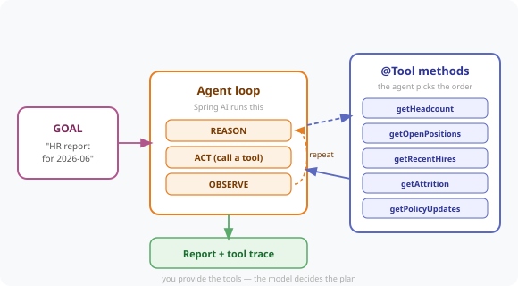

# Chapter 16 — AI Agents: Autonomous Workflows and Tool Chaining

Stop giving the AI instructions. Give it a **goal** and five tools, and let it work out the steps: "produce the HR report for 2026-06" → it gathers headcount, hires, open roles, attrition and policy changes on its own, then writes the report.



---

## Prerequisites

| Tool | Version | Check |
|------|---------|-------|
| Java | 25.0.3 | `java -version` |
| Maven | 3.9.16 | `mvn -version` |
| Ollama | 0.31.1 | `ollama --version` |

> **Versions:** These tutorials should work on the most recent versions of these tools. They were built and tested on **Java 25.0.3**, **Maven 3.9.16**, and **Ollama 0.31.1**.

---

## Setup

```bash
ollama pull llama3.2
ollama serve   # if not already running
```

---

## Run the Application

```bash
cd code/chapter-16-ai-agents
mvn spring-boot:run
```

Starts on **http://localhost:8080**.

---

## How It Works

Chapter 10 gave the bot one tool and told it when to use it. An **agent** gets a goal and decides the steps itself. The only difference in code is that you register *several* tools and stop prescribing the order:

```java
this.chatClient = builder
        .defaultSystem(SYSTEM_PROMPT)
        .defaultTools(hrData)      // five @Tool methods
        .build();
```

The prompt states the **goal and output format** — never the sequence:

```java
.user("""
      Produce the complete monthly HR report for %s.
      Gather whatever data you need using your tools first.
      """.formatted(month))
```

Spring AI runs the **Reason → Act → Observe** loop for you: the model asks for a tool, Spring executes it, feeds the result back, and the model decides what to do next — repeating until it has enough to answer.

### Making the agent observable

An agent that works is not the same as an agent you can trust. Each `@Tool` records that it was called, so the endpoint returns **what the agent actually did** alongside the report:

```json
{
  "month": "2026-06",
  "toolsInvoked": ["getHeadcount","getOpenPositions","getAttrition","getPolicyUpdates","getRecentHires"],
  "toolCallCount": 5,
  "tookMillis": 13937,
  "report": "**2026-06 HR Report** ..."
}
```

Note the order — it is neither the order the tools are declared in nor the order of the report's sections. That is the model's own plan, and without the trace you would never see it.

---

## Endpoints

| Method | URL | Description |
|--------|-----|-------------|
| `POST` | `/hr/report/generate` | Give the agent a goal — `{ month }` → report **+ execution trace** |
| `GET` | `/hr/agent/tools` | The five tools the agent is allowed to call |
| `GET` | `/hr/agent/data/{month}` | The raw HR data behind the tools (compare against the report) |

---

## Example Usage

```bash
curl -s -X POST http://localhost:8080/hr/report/generate \
  -H "Content-Type: application/json" \
  -d '{"month": "2026-06"}'
```

Real output (trimmed):

```
toolsInvoked : getHeadcount, getOpenPositions, getAttrition, getPolicyUpdates, getRecentHires
toolCallCount: 5
tookMillis   : 13937

**2026-06 HR Report**
**Headcount**      Total employees: 342   Change from last month: +12
**New Hires**      Priya Sharma - Senior Engineer; Tom Baker - Data Scientist
**Open Positions** Staff Engineer (critical); Data Scientist (critical); HR Business Partner
```

The figures come from the tools — `342` and `+12` are real values, not invented.

---

## Controlling an Agent

There is **no `maxToolCalls` setting** in Spring AI 2.0 — the loop ends when the model stops asking for tools. You bound an agent by design instead:

| Lever | Effect |
|---|---|
| **Tool descriptions** | The main steering wheel — vague descriptions cause wrong or missed calls |
| **System prompt** | Sets role and output format; say "use only values the tools return" to curb invention |
| **`temperature(0.0)`** | Makes planning repeatable |
| **The set of tools you register** | An agent can only do what you give it — this is your real safety boundary |
| **A recorded trace** | Not control, but you cannot debug what you cannot see |

---

## Common Errors

| Error | Cause | Fix |
|-------|-------|-----|
| Agent calls only one tool | Tool descriptions too vague, or goal too narrow | Make each `@Tool` description distinct and specific |
| Report contains invented numbers | Model padding gaps | Tell it explicitly to use only tool values; lower temperature |
| Report is truncated mid-section | `num-predict` too low for a long report | Raise it — this chapter uses `1200` |
| Slow first response | Agent makes several sequential model round-trips | Expected: 5 tool calls ≈ 14s locally |
| `Connection refused localhost:11434` | Ollama not running | Run `ollama serve` |

---

## Project Structure

```
chapter-16-ai-agents/
├── pom.xml
├── README.md
└── src/main/
    ├── java/com/techcorp/smarthr/
    │   ├── SmartHrAssistantApplication.java
    │   ├── controller/
    │   │   └── ReportAgentController.java   ← goal in, report + trace out
    │   ├── service/
    │   │   └── HrDataService.java           ← the five @Tool methods + invocation log
    │   └── model/
    │       ├── HrSnapshot.java
    │       ├── ReportRequest.java
    │       └── ReportResponse.java          ← includes toolsInvoked / toolCallCount
    └── resources/
        └── application.yml
```

---

*Full chapter write-up: [`content/chapters/chapter-16-ai-agents.md`](../../content/chapters/chapter-16-ai-agents.md)*
